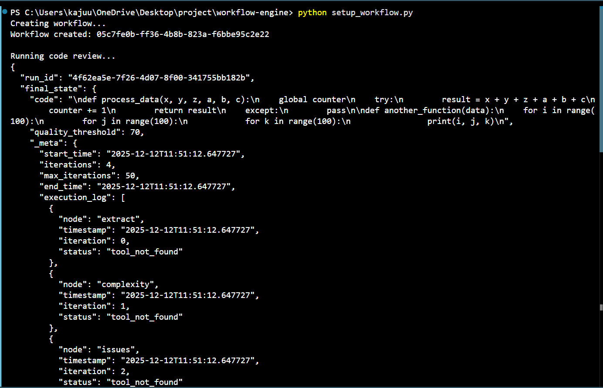
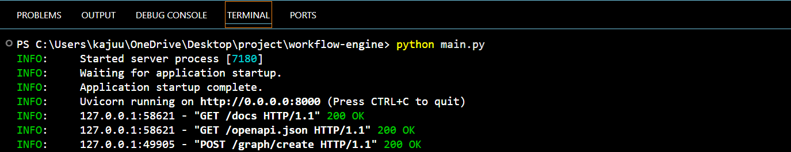
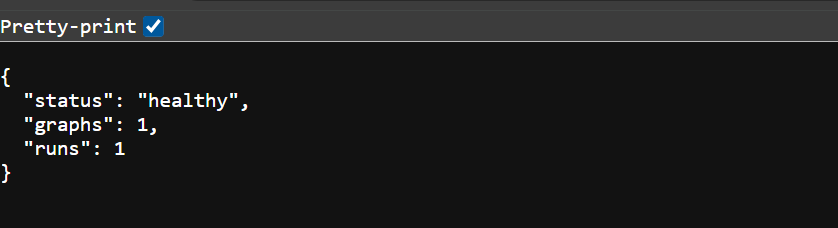

# Workflow Engine - AI Engineering Assignment

A simple but powerful workflow engine built with FastAPI that supports nodes, edges, branching, and looping.

## Features

- Node-based workflow execution
- Conditional branching based on state
- Loop support with iteration limits
- Tool registry for reusable functions
- WebSocket support for real-time execution logs
- RESTful API for graph management
- Code review workflow example included

## Screenshots

### API Documentation


### Workflow Execution


### Terminal Output


### Health Check



## Installation

```bash
pip install -r requirements.txt
```

## Running the Application

```bash
python main.py
```

The server will start on http://localhost:8000

## API Endpoints

### Create a Workflow
```
POST /graph/create
```

### Run a Workflow
```
POST /graph/run
```

### Get Run State
```
GET /graph/state/{run_id}
```

### WebSocket Stream
```
WS /ws/graph/run/{graph_id}
```

## Example Usage

1. Start the server
2. Run the setup script:
```bash
python setup_workflow.py
```

This will create a code review workflow and execute it on sample code.

## Workflow Engine Capabilities

- **State Management**: Dictionary-based state flows through nodes
- **Conditional Routing**: Edges support conditions evaluated against state
- **Loop Detection**: Iterations tracked to prevent infinite loops
- **Tool Registry**: Register Python functions as reusable tools
- **Async Execution**: Full async support for concurrent operations
- **Real-time Logs**: WebSocket streaming of execution progress

## Code Review Workflow

The included example implements a code quality pipeline:

1. **Extract Functions**: Parses code and identifies all functions
2. **Check Complexity**: Calculates complexity scores for each function
3. **Detect Issues**: Finds common code smells and anti-patterns
4. **Suggest Improvements**: Generates recommendations and quality score
5. **Loop**: Re-analyzes until quality score meets threshold

## Future Improvements

Given more time, I would add:

- Persistent storage with PostgreSQL/SQLite
- Parallel node execution
- Graph visualization endpoint
- Workflow templates library
- Better error recovery mechanisms
- Detailed metrics and monitoring
- Authentication and rate limiting
- Graph versioning system
- Cancellation and pause/resume support
